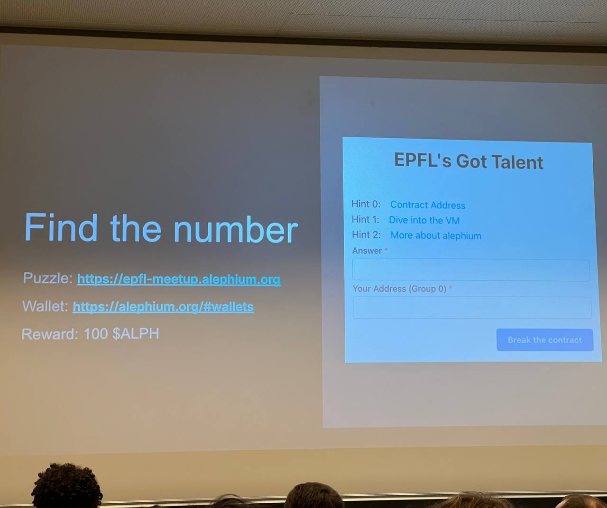

# cracking alephium's puzzle challenge

This is the detailed steps of how I managed to crack the alephium puzzle challenge.


# first steps

on the website, use the explorer to retrieve the transaction id, input it into the VM decoder

that gives you the bytecode for the contract, save it somewhere


# decoding the script

First my goal was to decode the script to get a better understanding of it

in the "breakdown" tab of the VM explorer, by passing the mouse over the colored instructions, we see that some of them are values and others are named instructions

[todo add instructions]

At this point, I could understand this to be instructions for a stack-based executer, because it looked similar to bitcoin op_codes script format.

But I wasn't sure of how to make sense of it, sure I could try to execute it by hand, but I'm lazy so I wanted to find an easier way.

My attempts at building a mock stack executer turned out a bit useless. You can find them in `src/stack_executer/`


# wrong direction

At this point, I wasn't too sure of what the puzzle solution format should look like, so I did some experiments with bruteforcing for text characters (which you can find in `src/letter search/`). Tried with normal letters, extended ones, even some dictionnary search with some added crypto related words.

Nothing proved fruitful and after bruteforcing for 5-6 letters, it became extremely slow.


# the missing fourth hint

I could feel I was probably not going in the right direction so I decided to recheck everything from scratch.

That's when I saw the picture from the presentation slides, which actually gives us one very precious hint that wasn't on the website: "find the number"



So we know that our goal is to find a number, not text characters, that's a big relief !


# using the stack instructions to limit the possibilities

So, I eventually realized I will have to execute the stack by hand

first I had to clean them a bit, the cleaned instructions can be found in `instructions.md`

now you execute them line by line trying to follow what a stack executer would do and noting what the code does as you go.

this is made more difficult by the "jump" instructions which (on conditions being true) make the executer jump to another instructions further in the list.

At least 5 times, the code does some test like this one:
```
    { "name": "U256Const5" },
    { "name": "ConstFalse" },
    { "name": "Swap" },
    { "name": "AssertWithErrorCode" },
```
here, we load "5" on the stack, then we load "false", swap them and check if the top value of the stack is true or we return an error.

But what we want is to get funds, so we look for functions related to moving funds and we find:
TransferAlphToSelf
TransferAlphFromSelf

since we want to get funds from the contract, the one we want to target is the second one, here it is with the instructions right above it:

```
    { "name": "LoadLocal", "index": 1 },
    { "name": "U256To8Byte" },
    { "name": "Blake2b" },
    { "name": "LoadImmField", "index": 1 },
    { "name": "ByteVecEq" },
    { "name": "U256Const3" },
    { "name": "AssertWithErrorCode" },
    { "name": "LoadLocal", "index": 0 },
    { "name": "LoadImmField", "index": 0 },
    { "name": "TransferAlphFromSelf" },
```

what can we read ? that to get to TransferAlphFromSelf, we need to:

- load local var 1 (which is the puzzle solution)
- convert it to 8 byte format
- apply Blake2b hash algorithm on it
- LoadImmField baffled me for some time, but looking into alephium doc I found that Imm stands for Immutables, some vars that are defined on contract deployment. 
  - so we load immutable field 1 (this is our target hash, we'll see how to retrieve it in the next step)  
- finally, we compare immutable field 1 (target hash) with the hash obtained from blake2b
- load 3 onto the stack then check if it's true (this seems like some useless code just here to confuse us)
- finally, load the the local field 0 (alephium address) and immutable field 0 (the amount of alephium to send, 100)
- transfer them from the contract to the address

so we start to realize we'll have to bruteforce using blake2b hash algorithm, but before that we need to find the target hash to bruteforce


# retrieving immutable values to get the target hash

the contract was created with somme immutable values, which are like hardcoded vars at the deployment

We can use the API of any alephium public node to retrieve those:

`$ curl 'https://node.mainnet.alephium.org/contracts/24MWgvENpiSY3asFLAVDuWLBViJTb8AjcK5U3EM6xhBZ9/state?group=0'`

which answers:
```json
{
  "address": "24MWgvENpiSY3asFLAVDuWLBViJTb8AjcK5U3EM6xhBZ9",
  "bytecode": "0201407f01010202004045d30bea1a18160113c1024cb016ea314c060c047c7b184a4035160113c1024cb016ea130a2c334c060d047c7b184a4029160113c1024cb016ea112c314c0c1601694ece01410e7b1600ce00a9024a17160113c1024cb016ea112c334c0c1601694ece01410f7b1600ce00a8024a0510047c7b1811047c7b18",
  "codeHash": "7121cb219839f5424b079e8df227e183bff9eb0b11af6bc206689ec534625998",
  "initialStateHash": "7e932b033913ee88b03ca64731572c96f95de766b0e95b0170b1216d17650fe7",
  "immFields": [
    {
      "type": "U256",
      "value": "100000000000000000000"
    },
    {
      "type": "ByteVec",
      "value": "0c1f9f51c90b70c1fb747c2860150d1187d248f508279cf3a24597039ab863d5"
    }
  ],
  "mutFields": [],
  "asset": {
    "attoAlphAmount": "100100000000000000000",
    "tokens": []
  }
}
```

the interesting part for us will be this value:

```json
    {
      "type": "ByteVec",
      "value": "0c1f9f51c90b70c1fb747c2860150d1187d248f508279cf3a24597039ab863d5"
    }
```

this is the target HASH we have to bruteforce !


# bruteforcing the hash

first wrote a script in javascript because that's faster to code for me

realized that I had some issues because you have to be very careful when converting to the 8 bytes buffer that it is coded as big-endian format (my first iteration wasn't, `src/bruteforce.js` uses little-endian format)

So i fixed it in `bruteforce_fix.js` to use big-endian format

finally I wanted to get things faster so I rebuilt it in python (`bruteforce.py`) but it was still too slow

rewrote it in GOlang (`src/bruteforce.go`) and it started to be a bit faster

Letting it run for a few hours resulted in this:

```text
[...]
Checked up to 59254999994  |  19.99%  |  left 06h 00m |  e1126a9d91063956e5cb6634c4ac6051b96bbbe3faecde2792043fc22e8fe3b2
Checked up to 59256999994  |  20.00%  |  left 06h 00m |  474196c203c29ef0a8c18aa37b0b8e188e47ac86d054e629ea72aef7d771d1b6
Checked up to 59258999994  |  20.00%  |  left 06h 00m |  5b7e060f9528c6d91b1449ade44715632136516b26c480f5df071d581dbe28f9
Found matching U256 value: 59259259260
```

and voilà, you got your puzzle solution: 59259259260
