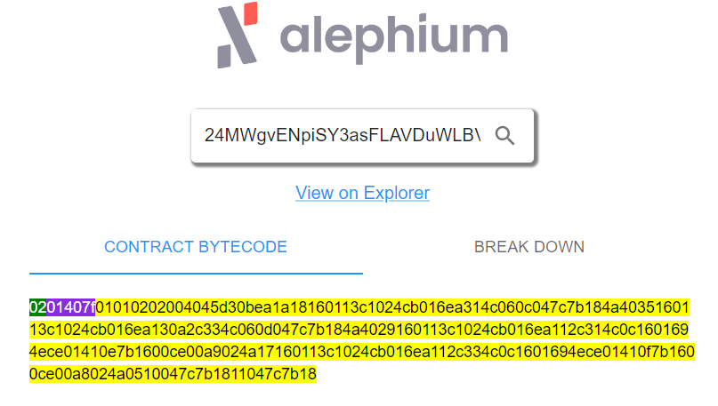

# cracking alephium's puzzle challenge

This is the detailed steps of how I managed to crack the alephium puzzle challenge for the EPFL meetup

The site for the challenge is at  https://epfl-meetup.alephium.org and we were given these hints:

- hint0: [contract address](https://explorer.alephium.org/addresses/24MWgvENpiSY3asFLAVDuWLBViJTb8AjcK5U3EM6xhBZ9)
- hint1: [VM explorer](https://alephium-decoder.softfork.se/)
- hint2: [DOC](https://docs.alephium.org/dapps/concepts/overview)


# first steps

on the website, use the explorer to retrieve the transaction id, input it into the VM decoder

that gives you the bytecode for the contract, save it somewhere




# decoding the script

First my goal was to decode the script to get a better understanding of it

in the "breakdown" tab of the VM explorer, by passing the mouse over the colored instructions, we see that some of them are values and others are named instructions


I found that I can use the `@alephium/web3` package to try to decode it more properly

you can find that in `decoder.js`, but basically this is it:

```js
const bytecodeBuffer = Buffer.from(contract_bytecode, 'hex');
const decoded = codec.contract.contractCodec.decodeContract(bytecodeBuffer)
console.log("instrs:", decoded.methods[0].instrs)
```

and the result looks like this:

```js
instrs: [
  { name: 'MethodSelector', code: 211, selector: 199891480 },
  { name: 'LoadLocal', code: 22, index: 1 },
  { name: 'U256Const', code: 19, value: 9876543210n },
  { name: 'U256Lt', code: 49 },
  [...]
  { name: 'Swap', code: 124 },
  { name: 'AssertWithErrorCode', code: 123 },
  { name: 'Pop', code: 24 }
]
```

# trying to make sense of it

At this point, I could understand this to be instructions for a stack-based executer, because it looked similar to bitcoin's op_codes script format, [here is a great article on stack in bitcoin script](https://scryptplatform.medium.com/introduction-to-bitcoin-smart-contracts-9c0ea37dc757).

The `code` property for each instruction is just a reference value, so we can ignore it, other properties are the arg/vars used to call the instruction. For example:

```js
{ name: 'U256Const', code: 19, value: 9876543210n },
```

loads a constant var of value 9876543210n, it's essentially the same as:
```js
const myvar = 9876543210
```


# wrong directions

I wasn't sure how to make sense of all of it, sure I could try to execute entirely by hand, but I'm lazy so I wanted to find an easier way.

My attempts at building a mock stack executer turned out a bit useless, because it didn't really help me understand what was the intent of the code. You can find them in `src/stack_executer/`

At this point, I wasn't too sure of what the puzzle solution format should look like, so I did some experiments with bruteforcing for text characters (which you can find in `src/letter search/`). Tried with normal letters, extended ones, even some dictionnary search with some added crypto related words.

Nothing proved fruitful and after bruteforcing for 5-6 letters, it became extremely slow.


# the missing fourth hint

I could feel I was probably not going in the right direction so I decided to recheck everything from scratch.

That's when I saw the picture from the presentation slides, which actually gives us one very precious hint that wasn't on the website: "find the number"


So we know that our goal is to find a number, not text characters, that's a big relief !


# using stack instructions to limit the range

So, I eventually realized I will have to execute the stack by hand 😩

First I had to clean them a bit, the cleaned instructions can be found in `instructions.md`

Now you execute them line by line trying to follow what a stack executer would do and noting what the code does as you go.

This is made more difficult by the "jump" instructions which (on conditions being true) make the executer jump to another instructions further in the list.

At least 5 times, the code does some test like this:
```
    { "name": "U256Const5" },
    { "name": "ConstFalse" },
    { "name": "Swap" },
    { "name": "AssertWithErrorCode" },
```
Here, we load "5" on the stack, then we load "false", swap them and check if the top value of the stack is true or we return an error. it seems really useless as it would be the same as just aborting with error, but it's probably done that way to add confusion?

## let's focus on the goal

What we want is to get funds, so we look for functions related to moving funds and we find:
- TransferAlphToSelf
- TransferAlphFromSelf

since we want to get funds from the contract, the one we want to target is the second one, here it is with the instructions right above it:

```
    { "name": "LoadLocal", "index": 1 },
    { "name": "U256To8Byte" },
    { "name": "Blake2b" },
    { "name": "LoadImmField", "index": 1 },
    { "name": "ByteVecEq" },
    { "name": "U256Const3" },
    { "name": "AssertWithErrorCode" },
    { "name": "LoadLocal", "index": 0 },
    { "name": "LoadImmField", "index": 0 },
    { "name": "TransferAlphFromSelf" },
```

What can we read ? that to get to TransferAlphFromSelf, we need to:

- load local var 1 onto the stack (which is the puzzle solution we have to provide)
- convert it to 8 byte format
- apply Blake2b hash algorithm on it
- this next instruction, LoadImmField, baffled me for some time, but looking into [alephium's doc on contract deployment](https://docs.alephium.org/dapps/tutorials/deep-dive/#deploy-your-contract) I found that Imm stands for Immutables, some vars that are defined on contract deployment. 
  - the doc explains: `In the immFields we can see our initial TokenFaucet arguments (symbol, name, decimals, supply). `
  - so we load immutable field 1 onto the stack (this is our target hash, we'll see how to retrieve it in the next step)  
- finally, we compare immutable field 1 (target hash) with the hash obtained from blake2b
- load "3" onto the stack then check if it's true (this seems like some useless code just here to confuse us)
- finally, load the the local field 0 (an alephium address) and immutable field 0 (the amount of alephium to send, 100)
- call TransferAlphFromSelf

So we start to realize we'll have to bruteforce using blake2b hash algorithm, but before that we need to find the target hash to bruteforce

# reducing the bruteforce range based on the instructions' logic

Reminder:
- LoadLocal to load value relative to execution context (ex args passed to current function)
- vs LoadImmField loads the global args that are immutables

Finally, from the intructions we can deduce what the four meaningful tests do:

```js
var < 9876543210 ?
	false => offset 6 => jump to 2nd test
	true => error

var > 9876543210 * 10 ?
	false => offset 6 => jump to 3rd test
	true => error

var < 5 * 9876543210 ?
	false => offset 12 => jump to 4th test
	true => TransferAlphToSelf (doesn't make sense for us)

var > 5 * 9876543210 ?
	false => offset 12 => error
	true => TransferAlphFromSelf (that's what we want)
```

so we can deduce:

```js
var < 9876543210  is false
var > 98765423100 is false
var < 49378216050 is false
var > 49378216050 is true
```

this means thar var is in [49378216050, 98765423100]

this already gives us a limited range to bruteforce, nice !


# retrieving immutable values to find the target hash

the contract was created with somme immutable values, which are like hardcoded vars at the deployment

As explained in [this page of the doc](https://docs.alephium.org/dapps/tutorials/deep-dive/#create-a-new-project), we can use the API of any alephium public node to retrieve those:

`$ curl 'https://node.mainnet.alephium.org/contracts/24MWgvENpiSY3asFLAVDuWLBViJTb8AjcK5U3EM6xhBZ9/state?group=0'`

which answers:
```json
{
  "address": "24MWgvENpiSY3asFLAVDuWLBViJTb8AjcK5U3EM6xhBZ9",
  "bytecode": "0201407f01010202004045d30bea1a18160113c1024cb016ea314c060c047c7b184a4035160113c1024cb016ea130a2c334c060d047c7b184a4029160113c1024cb016ea112c314c0c1601694ece01410e7b1600ce00a9024a17160113c1024cb016ea112c334c0c1601694ece01410f7b1600ce00a8024a0510047c7b1811047c7b18",
  "codeHash": "7121cb219839f5424b079e8df227e183bff9eb0b11af6bc206689ec534625998",
  "initialStateHash": "7e932b033913ee88b03ca64731572c96f95de766b0e95b0170b1216d17650fe7",
  "immFields": [
    {
      "type": "U256",
      "value": "100000000000000000000"
    },
    {
      "type": "ByteVec",
      "value": "0c1f9f51c90b70c1fb747c2860150d1187d248f508279cf3a24597039ab863d5"
    }
  ],
  "mutFields": [],
  "asset": {
    "attoAlphAmount": "100100000000000000000",
    "tokens": []
  }
}
```

the interesting part for us will be this value:

```json
    {
      "type": "ByteVec",
      "value": "0c1f9f51c90b70c1fb747c2860150d1187d248f508279cf3a24597039ab863d5"
    }
```

this is the target HASH we have to bruteforce !


# bruteforcing the hash

first wrote a script in javascript because that's faster to code for me

realized that I had some issues because you have to be very careful when converting to the 8 bytes buffer that it is coded as big-endian format (my first iteration wasn't, `src/bruteforce.js` uses little-endian format)

So i fixed it in `bruteforce_fix.js` to use big-endian format

finally I wanted to get things faster so I rebuilt it in python (`bruteforce.py`) but it was still too slow

rewrote it in GOlang (`src/bruteforce.go`) and it started to be a bit faster

Letting it run for a few hours resulted in this:

```text
[...]
Checked up to 59254999994  |  19.99%  |  left 06h 00m |  e1126a9d91063956e5cb6634c4ac6051b96bbbe3faecde2792043fc22e8fe3b2
Checked up to 59256999994  |  20.00%  |  left 06h 00m |  474196c203c29ef0a8c18aa37b0b8e188e47ac86d054e629ea72aef7d771d1b6
Checked up to 59258999994  |  20.00%  |  left 06h 00m |  5b7e060f9528c6d91b1449ade44715632136516b26c480f5df071d581dbe28f9
Found matching U256 value: 59259259260
```

and voilà, you got your puzzle solution: 59259259260

input that with an alephium group0 address into the challenge and a transaction is generated sending the coins to you


